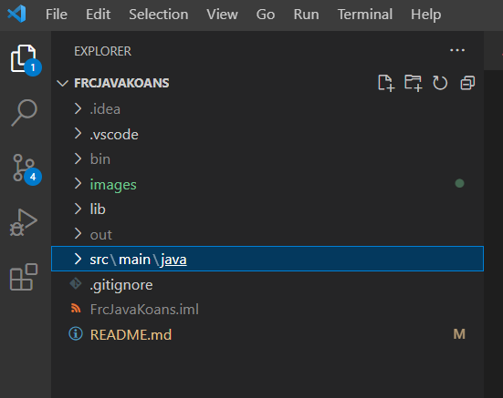
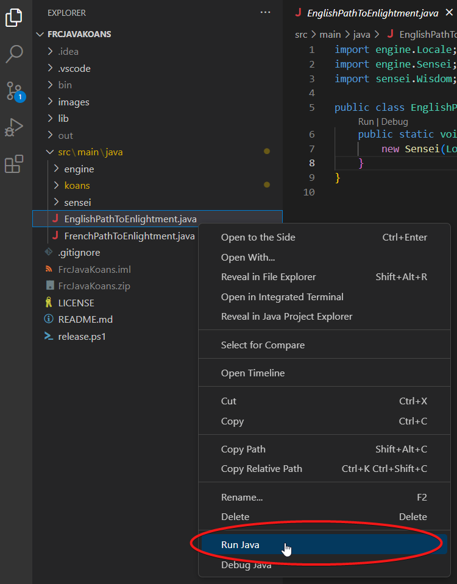
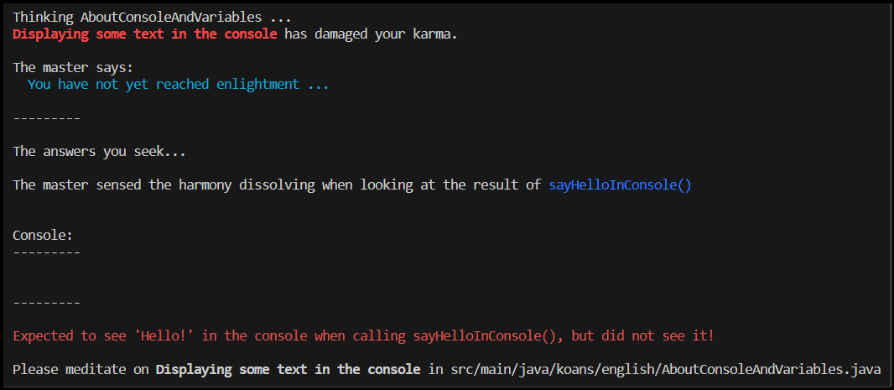
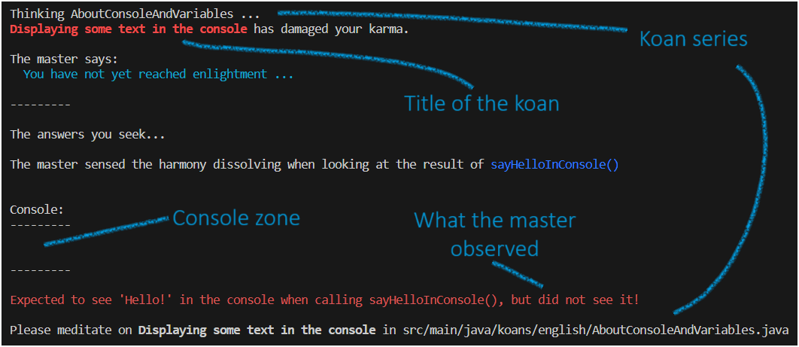
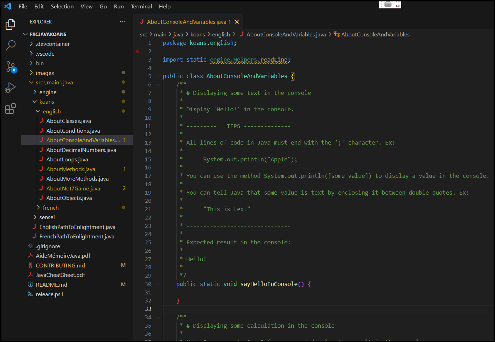
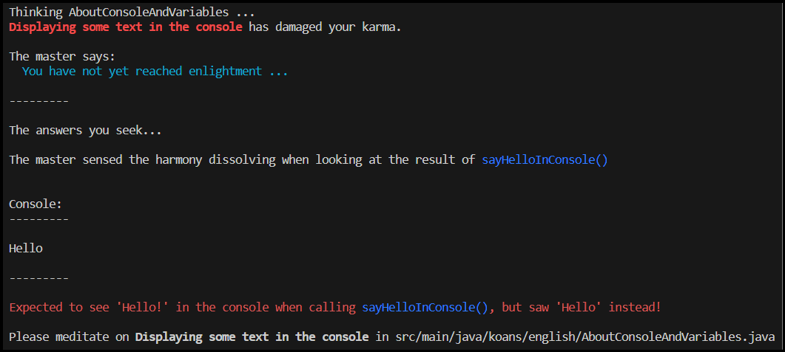
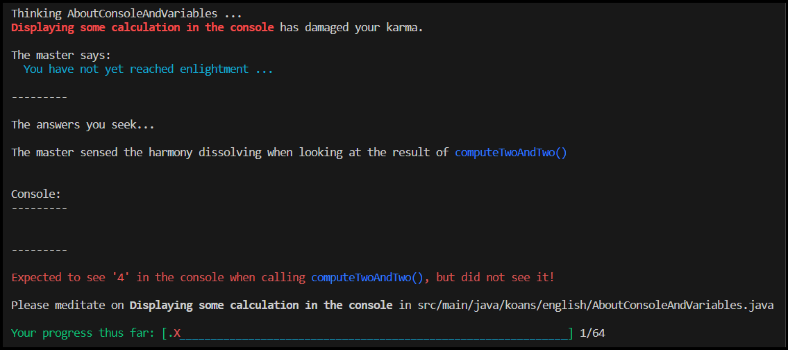

## Table of content

- [Getting Started with Intellij-IDE](#getting-started-with-intellij-ide)
- [Learning to code with the Java Koans for the FRC](#learning-to-code-with-the-java-koans-for-the-frc)
- [Java cheat sheet](#java-cheat-sheet)
- [And then what?](#and-then-what)

## Getting Started with Intellij IDE

To get started you will need to have Intellij-IDE installed. Have you followed the presentations?

Once installed, copy this project's URL to sublime merge (As explained in the presentation!)

And open the folder in Intellij. 


Note: Intellij will ask you if you trust the code within the folder. Press 'yes'.

## Learning to code with the Java Koans for the FRC

A koan is a challenge a zen master is throwing at you to help you learn something. 
Here, your mission is to solve koans which will help you learn about programming in Java.

### Ask the master for koans

When you open the Java Koans for the FRC in VS Code, you should see something similar to this:



Expand the `src` folder, then right click on the file `src\main\java\EnglishPathToEnlightment.java` and choose `Run Java`:



This will open what is called a _terminal_ at the bottom of the Intellij IDE window and run the Java Koans for the FRC. 

Focus on this part:


The master of the Java Koans is telling you a lot of things at once, so let's decompose a bit:


First, it tells you that it is trying to teach you  `AboutConsoleAndVariables`. 
Then it tells you that you did not complete the `Displaying some text in the console` koan.
Which is normal, because you have not even started yet! 
Then it shows a mysterious `Console` box, which we will ignore for now. 
At the very bottom, it tells you you can look for `Displaying some text in the console` in the `src/main/java/koans/AboutConsoleAndVariables.java` file.

### Opening the koan file

Open that file in Intellij IDE:



Wow, there is a lot going on! In order to understand what is all of this, we need to learn a few things about Java.

### Java files

All the code written in Java must go in files with the `.java` extension. The content of these files follow a pretty strict organisation. First at the top, there are a few lines helping Java knowing which other files it will need to get in order to make sense of this one:

```java
package koans.english;

import static engine.Helpers.readLine;
```

We will not explain the details of these lines for now and ignore them. Don't worry, when done with the koans, you will understand them!

### The class

Next in the file, we can see this:

```java
public class AboutConsoleAndVariables {
```

This tells Java that we are creating a `AboutConsoleAndVariables` class. All the bits of code in Java are organised in classes. You can think of a class like a drawer or a shelf containing bits of code. You can only have one class in a java file, and the name of the file must be the name of the class, with the `.java` extension. This is why the file we are looking at is named `AboutConsoleAndVariables.java`. All the code of a class is contained between the opening `{` and the closing `}` at the bottom of the file.

Note: everywhere in Java where you will need to 'enclose' a bit of code, we will use an opening `{` and a closing `}`. This will tell Java that everything between those curly brackets are belonging to the same thing.

### The koan instructions

Next, we can see these lines, colored in green:

```java
    /**
     * # Displaying some text in the console
     * 
     * Display 'Hello!' in the console.
     * 
     * ---------   TIPS --------------
     * 
     * All lines of code in Java must end with the ';' character. Ex:
     * 
     *      System.out.println("Apple");
     * 
     * You can use the method System.out.println([some value]) to display a value in the console.
     * 
     * You can tell Java that some value is text by enclosing it between double quotes. Ex:
     * 
     *      "This is text"
     * 
     * -------------------------------
     * 
     * Expected result in the console:
     * 
     * Hello!
     * 
     */
```

These lines are forming what's called a 'comment'. All the text between a `/*` and a `*/` is a comment. A comment is a piece of information that is ignored by Java. It is not code. It is very useful for documenting your code while you are writing Java. The master is putting each Koan's instructions for you in such a comment.

The first line of the comment tells you the title of the Koan: `# Displaying some text in the console`.

Then comes the goal of the koan at the top of each such comment: `Display 'Hello!' in the console.`. The console is the simplest way for a Java program to communicate with you by displaying simple text in a terminal. Remember what was displayed when running the Koans? You saw this bit:

```
Console:
---------


---------
```

This is where the text will appear when you will program something displaying text in the console.

After the goal of the koan, the comment goes on with tips on how to solve the koan. For example, it is telling you to use `System.out.println([some value])`. Note: when you see square brackets '['  and ']' in the master's instructions, it is not something to type in directly, but rather it is a placeholder for you to type something else.

Finally, the last section of the comment is showing you what result your code is expected to produce.

When trying to solve a koan, take your time to understand all the information that is given to you to successfully solve it.

### The koan method

Finally, we arrive at the part of the file where you will be able to code in Java! In Java all the code must be part of a "program chunk" called a method. A method is really nothing else than a mini-program. Here is the method of the first koan:

```java
    public static void sayHelloInConsole() {

    }
```

We will ignore the `public static void` part for now. What comes next is the name of the method: `sayHelloInConsole`. All the code chunks in Java have names, allowing to refer to it later, if we want to run that piece of code. Then comes parentheses: `()`. This is basically telling Java that `sayHelloInConsole` is a method. And at last, the opening `{` and closing `}`. All the code you will write will have to go in between those 2 curly brackets, and nowhere else. If you write code outside of the curly brackets of a method, Java will show you an error.

So let's try so solve this first koan. To do it, we have to display "Hello!" in the console. The first tip for doing so is:

```
     * All lines of code in Java must end with the ';' character.
```

Ok, so we can at least put a ';' at the end of our line, so we don't forget:

```java
    public static void sayHelloInConsole() {
        ;
    }
```

The next piece of tip is:

```
     * You can use the method System.out.println([some value]) to write something in the console.
```

So we know we should use this command, and find a way to replace `[some value]` by the _Hello!_ text later. Let's write down the command without the value for now:

```java
    public static void sayHelloInConsole() {
        System.out.println();
    }
```

Next the final tip is telling us how to write a text value:

```
     * You can tell Java that some value is text by enclosing it between double quotes.
```

Perfect! So let's place the value within the previous command:

```java
    public static void sayHelloInConsole() {
        System.out.println("Hello");
    }
```

### Running the koans again

Now that we think we completed the koan, let's ask the master what he thinks and see what happens. To run the koans, right-click on `EnglishPathToEnlightment.java` and choose `Run Java`. You should see this output:





Oops, we made a mistake! The master was expecting us to display _Hello!_, but we forgot the exclamation mark. Let's fix it in `src/main/java/koans/AboutConsoleAndVariables.java`:

```java
    public static void sayHelloInConsole() {
        System.out.println("Hello!");
    }
```

And run the koans again:




That's a completely different message! This is because we successfully completed the first koan! So our master is telling us about our progress and about the next koan.

Congratulations, you completed your first koan! You can now look at the next koan in the `src/main/java/koans/AboutConsoleAndVariables.java` file and try to figure out how to complete the next koan!

## Java cheat sheet

To help you remember the bits of Java syntax you are learning while completing your koans, you can print a copy of the [Java Cheat Sheet](./JavaCheatSheet.pdf).

## And then what?

When you're finished let me know in the whatsapp.

### Topics included

* Printing to and reading from the console
* Variables
* `int`, `boolean`, `String`, `double` basic types
* `if`, `else`, `if else` construct
* Methods
* `while` loops
* Packages and classes with static methods
* Objects, constructors, fields
